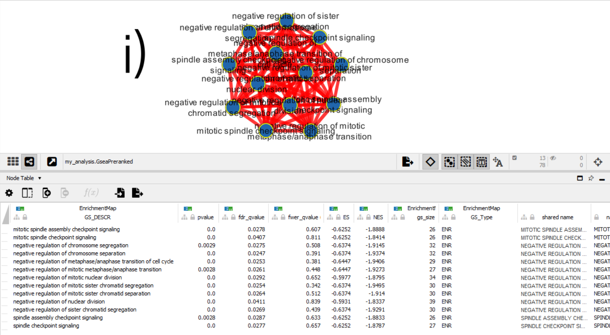
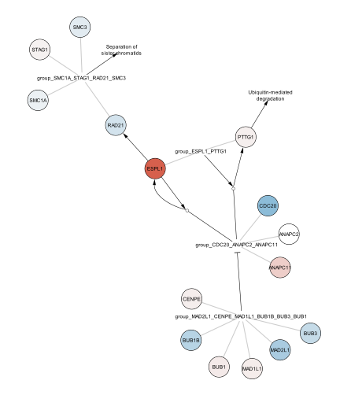
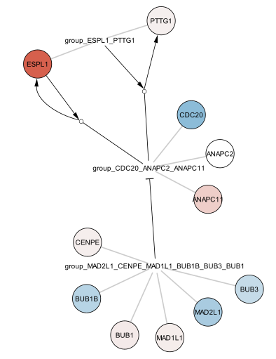

```{r setup, include=FALSE}
knitr::opts_chunk$set(echo = TRUE)
```

# Introduction and Summary of Past Works

This document is an extension of the work done up to A2 in the course BCB420, where I ranked all the sampled genes via differential expression and conducted threshold over-representation gene analysis. This list of the ranked genes has now been used for non-thresholded gene set enrichment analysis (GSEA, cited below). This gene enrichment analysis was then visualized in Cytoscape (cited below), for begin to understand pathways of genes that are being differentially expressed.
The genetic data being used was downloaded from GEO with id GSE158890 [(Link)] (https://www.ncbi.nlm.nih.gov/geo/query/acc.cgi?acc=GSE158890). The RNAseq data was collected by Koukoulas et al., as part of a study looking to better understand the role of Hypoxia inducible factor-1 (HIF-1) and Nucleophosmin 1 (NPM1) on gene expression under hypoxia. 

Koukoulas K, Giakountis A, Karagiota A, Samiotaki M et al. ERK signaling controls productive HIF-1 binding to chromatin and cancer cell adaptation to hypoxia through HIF-1α interaction with NPM1. Mol Oncol 2021 Dec;15(12):3468-3489. PMID: 34388291

# Non-Thresholded Gene Set Expression Analaysis (GSEA)

Purpose: To determine if any gene sets or pathways are differentially expression suprisingly high or low in our ranked list from A2.

Method: 
- Within the GSEA software, these were the file inputs and parameters used to 'Run Gsea on a Pre-Ranked gene list'.

- GSE158890_ranked_genelist.rnk : a file of differentially expressed genes in the siNPM group, ranked by their F-stat
- Gene set database used for this analysis: Human_GOBP_AllPathways_no_GO_iea_April_01_2022_symbol.gmt
  - This is the Bader Lab's latest geneset, it consists of genesets for Gene Ontology, Pathway databases, human phenotype, drugbank
  - Downloaded through R commands from BCB420 Lecture 10 notes
```{r warning = FALSE, message = FALSE}

#install required R and bioconductor packages
tryCatch(expr = { library("RCurl")},
         error = function(e) {  install.packages("RCurl")},
         finally = library("RCurl"))

tryCatch(expr = { library("BiocManager")},
         error = function(e) {
           install.packages("BiocManager")},
         finally = library("BiocManager"))
tryCatch(expr = { library("ggplot2")},
         error = function(e) { install.packages("ggplot2")},
         finally = library("ggplot2"))

gmt_url = "http://download.baderlab.org/EM_Genesets/current_release/Human/symbol/"
# list all the files on the server
filenames = getURL(gmt_url)
tc = textConnection(filenames)
contents = readLines(tc)
close(tc)
# get the gmt that has all the pathways and does not include terms inferred
# from electronic annotations(IEA) start with gmt file that has pathways only
rx = gregexpr("(?<=<a href=\")(.*.GOBP_AllPathways_no_GO_iea.*.)(.gmt)(?=\">)", contents,
              perl = TRUE)
gmt_file = unlist(regmatches(contents, rx))
dest_gmt_file <- file.path(getwd(), gmt_file)
download.file(paste(gmt_url, gmt_file, sep = ""), destfile = dest_gmt_file)

```

- GSEA Parameters:    
  - Gene set database: Human_GOBP_AllPathways_no_GO_iea_April_01_2022_symbol.gmt
  - Number of permutations: 1000
  - Ranked List: GSE158890_ranked_genelist.rnk
  - Collapse/Remap to gene symbols: Remap_Only (Reasoning: my .rnk file stored the genes by EnsemblID, this configuration allows me to continue without altering the mathematical             processes)
  - Chip Platform: Human_ENSEMBL_Gene_ID_MSigDB.v7.5.1.chip (The applicable chip: Humans + Ensembl)

# Visualizing Geneset Enrichment Analysis in Cytoscape

Method:
- Download and install the Enrichment Map app
- Within the app, select the GSEA output directory as the input for enrichment data
  - Default parameters
  - Nodes are connected by similarity Coefficient; default uses combination of Jaccard coefficient and Overlap 

Results: 
- 181 different nodes, with 436 edges in the resulting map
- Red indicates samples with silenced Nucleophosmin 1 (NPM1), and blue represents wildtype (WT) samples.

```{r, echo=FALSE, out.width="1200px", fig.cap="<span style=text-decoration:underline>Figure #1: Enrichment Map on Cytoscape from differential expression values of siNMP cells from GSE158890</span>"}
  

```

```{r, echo=FALSE, out.width="1200px", fig.cap="<span style=text-decoration:underline>Figure #2: Cluster Group i) (top left blue cluster in Fig #2) Shows a number of genesets found to be differentially expressed in siNMP cells from GSE158890</span>"}
  

```

## Pathway Details

Setting out to understand how the genes in the pathway are connect, to perhaps understand the trajectory of signals or molecules. This will also help us significantly understand the disease. 

Looking at the cluster labeled as i), shown in Figure 2. This was the blue (siNPM) cluster with the greatest number of connected nodes and strongest interconnectivity between them (13 nodes, 78 edges). The largest gene set part of this cluster is NEGATIVE REGULATION OF NUCLEAR DIVISION (GO:0051784). On Cytoscape it says the geneset size is 39, but a query on AMIGO2 indicates 47 human genes in GO:0051784 (1). 30 genes were found to code for a mitotic spindle assembly checkpoint signaling protein, such as BUB1, a serine/threonine-protein kinase. 

To visualize the mechanism of any potential pathway, I searched WikiPathways for a related geneset. The search for spindle returned a Wikipathway called Regulation of sister chromatid separation at the metaphase-anaphase transition	Homo sapiens	(id="WP4240"). This matched one of the genesets part of this cluster (Fig. 2), GO:1902100, which is named NEGATIVE REGULATION OF METAPHASE/ANAPHASE TRANSITION OF CELL CYCLE.

I imported the Wikipathway:WP4240 as a network, imported the ranked gene set list from A2, and overlayed the expression data on the fill colour of the pathway (see Figure #3,4).


```{r, echo=FALSE, out.width="600px",fig.align='center', fig.cap="<span style=text-decoration:underline>Figure #3:  Wikipathway Regulation of sister chromatid separation at the metaphase-anaphase transition with fill colour representing differential expression in wildtype (Red) and siNPM cells (Blue)(wikipathway id: WP4240)</span>"}
  

```

```{r, echo=FALSE, out.width="600px", fig.align='center', fig.cap="<span style=text-decoration:underline>Figure #4: Replication of Figure #3, zoomed for focus on significantly expressed groups.</span>"}
  

```

# Discussion and Conclusion

Figure #2 shows a cluster of 13 genesets found to be differentially expressed in the siNPM population. The strong majority of these genesets are described as negative regulators of continuation at various checkpoints in the mitosis process, specifically chromosome segregation, meta/anaphase transition, nuclear division, and chromatid segregation. 

To understand a potential underlying pathway mechanism connecting the genesets with disease, a pathway analaysis was conducted specifically on this cluster. The largest geneset in this group was NEGATIVE REGULATION OF NUCLEAR DIVISION (GO:0051784), and a quick search on AMIGO2 (GOBP's lookup tool), revealed it coded for genes again encoding for a mitotic spindle assembly checkpoint signaling protein, such as BUB1, a serine/threonine-protein kinase (1). A matching Wikipathways geneset was imported, and the expression data from the A2 ranked list was overlayed (see Figure #3). 

Considering that red nodes denote those significantly expressed in wildtype cells, it appears ESPL1 promotes the complex called group CDC20 ANAPC2 ANAPC11 (group CAA). A quick Uniprot search reveals ESPL1 is important for the chromosome segregation by cleaving a subunit at the start of anaphase. However, in siNPM individuals (blue), members of the CENPE, BUB1/3, MAD1/2 group (group CBM) are promoted. The Wikipathway indicates group CBM inhibits expression of group CAA. Literature confirmed some of this, as MAD2L1 encodes for a mitotic arrest deficient protein(3).  

Looking at paper from the publication of the original data, by Koukoulas et al., one of their results found that siNPM1 cells died 20% more often than control normaltype cells in 1% 02 environemnts over 48 hours (Fig 5 in the paper, p < 0.001). This indicates that the presence of a non-functional siNPM1 protein is correlated with group CBM expression, which inhibits cellular replication. 

Based off of the evidence presented in the reference paper, as well as the results of our own expression analyses, it would suggest that some regulator of the genes responsible for hypoxic conditions, activates the CBM group to stop cell division, due to either actors not functioning in hypoxic conditions, or the inability to form a functional ESPL1 protein. 

The recommended next steps would be to determine the depth of the relationship between NPM1 and ESPL1, and perhaps some sort of therapy could correct the protein or provide the necessary cofactors to render the proteins functional again.

# References:


We acknowledge our use of the gene set enrichment analysis, GSEA software, and Molecular Signature Database (MSigDB) (Subramanian, Tamayo, et al. (2005), PNAS 102, 15545-15550, http://www.broad.mit.edu/gsea/).

GO Enrichment Analysis: Mi H, Huang X, Muruganujan A, Tang H, Mills C, Kang D, Thomas PD. PANTHER version 14: more genomes, a new PANTHER GO-slim and improvements in enrichment analysis tools. Nucleic Acids Res. Jan 2019;47(D1):D419-D426. 

Koukoulas K, Giakountis A, Karagiota A, Samiotaki M et al. ERK signaling controls productive HIF-1 binding to chromatin and cancer cell adaptation to hypoxia through HIF-1α interaction with NPM1. Mol Oncol 2021 Dec;15(12):3468-3489. PMID: 34388291

Shannon, P., Markiel, A., Ozier, O., Baliga, N. S., Wang, J. T., Ramage, D., … Ideker, T. (2003). Cytoscape: a software environment for integrated models of biomolecular interaction networks. Genome Research, 13(11), 2498–2504.

Martens M, Ammar A, Riutta A, Waagmeester A, Slenter DN, Hanspers K, Miller RA, Digles D, Lopes EN, Ehrhart F, Dupuis LJ, Winckers LA, Coort SL, Willighagen EL, Evelo CT, Pico AR, Kutmon M. WikiPathways: connecting communities Nucleic Acids Research, (2021), Volume 49, Issue D1, 8 January 2021, Pages D613–D621, doi.org/10.1093/nar/gkaa1024 PMID:33211851.

1. AmiGO: Carbon S, Ireland A, Mungall CJ, Shu S, Marshall B, Lewis S, AmiGO Hub, Web Presence Working Group. AmiGO:     online access to ontology and annotation data. Bioinformatics. Jan 2009;25(2):288-289. 

2. The UniProt Consortium. UniProt: the universal protein knowledgebase in 2021. Nucleic Acids Res. 49:D1 (2021)

3. HGNC Database, HUGO Gene Nomenclature Committee (HGNC), European Molecular Biology Laboratory, European Bioinformatics Institute (EMBL-EBI), Wellcome Genome Campus, Hinxton, Cambridge CB10 1SD, United Kingdom www.genenames.org.
